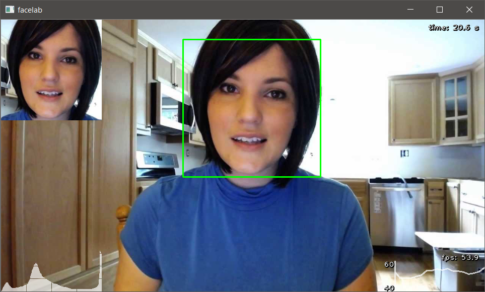

# Facelab

Facelab is a graphical front-end for doing image recognition and processing, primarily on faces. It is written in Python and OpenCV, and is designed to be extensible. 

Each graphical element is a 'Widget' object, that runs in a separate thread. Widgets can be added in and removed with minimal changes to the code - they are all loaded at runtime. All the graphical operations are handled by OpenCV for speed.

Currently, the code comprises:
* Histogram plot of pixel intensities
* Frame rate (FPS) and history plot
* Elapsed time
* Haar cascade face detector
* Picture-in-picture view of detector output

Run the code by executing `main.py`. Requires Python 3, numpy and OpenCV 3+.

Contributions welcome.

